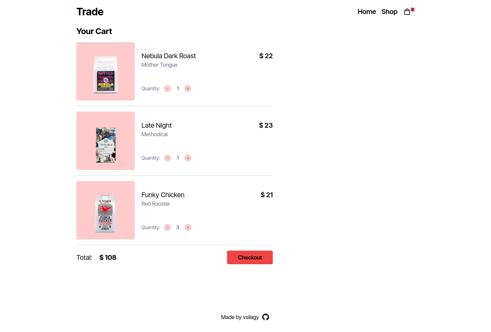

# Shopping Cart

A shopping cart built with react and tailwind

[Live Preview](https://coffee-shopping-cart.netlify.app/)

## Built with:

- [React](https://reactjs.org/)
- [Tailwind](https://tailwindcss.com/)
- [Vite](https://vitejs.dev/)
- [Netlify](https://www.netlify.com/)

### **The Odin Project**: [Shopping Cart](https://www.theodinproject.com/lessons/node-path-javascript-shopping-cart)

#### Objectives:

- build a shopping cart with 2 pages: homepage and shop
- use react-router-dom for routing
- display the number of items currently in the cart
- built individual card items with a button "add to cart"
- in the cart add an increment and decrement button for amount of
